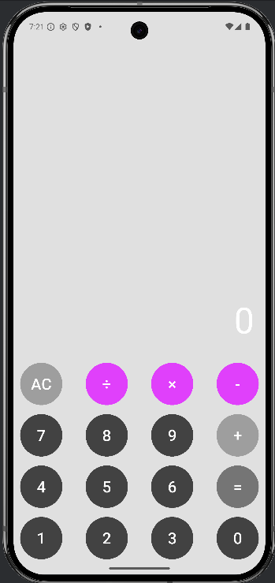

# Calculator App

A simple calculator application built using Flutter & Dart.

## 📱 Features
- Addition
- Subtraction
- Multiplication
- Division

## 🛠 Tech Stack
- Flutter
- Dart

## 🚀 How to Run
1. Clone the repository
2. Run `flutter pub get`
3. Run on emulator or physical device

## 👨‍💻 Author
MD Suhagh Ahamed
## 📸 App Screenshot

